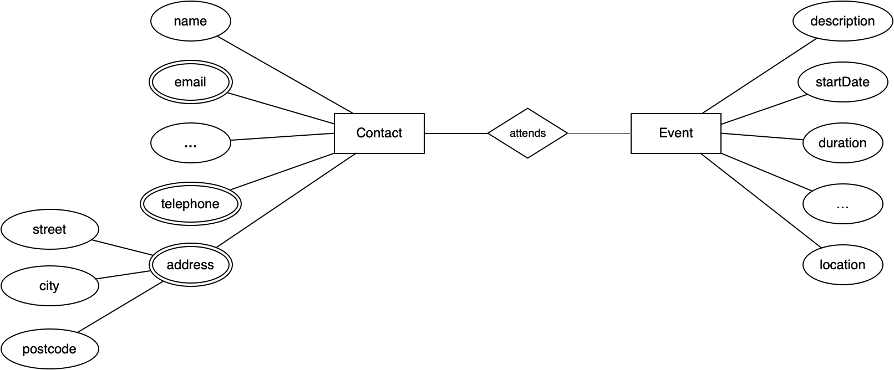

Andersoortige data
==================

Als voorbeeld van andersoortige data gebruiken we een database-model met twee entiteiten (Contact, Event) en een relatie ("neemt deel aan"/deelnemer).
Denk als toepassing(en) in dit geval aan de contacten- en agenda-toepassingen op een smartphone.
Van de entiteiten Contact en Event hebben we soms weinig, en soms veel gegevens (attributen).

   Contact - neemt deel aan - Event

Entiteit Contact, met attributen o.a.:

* naam (voornaam, achternaam)
* adres (straat, nummer, woonplaats, postcode)
* email-adres(sen)
* telefoonnummer(s)
* geboortedatum
* partner
* ...

Entiteit Event ("afspraak" in een agenda),  met attributen o.a.:
* begintijd, eindtijd
* deelnemers (zo mogelijk als verwijzingen naar de contactgegevens)
* onderwerp
* locatie
* ...

In beide gevallen hebben we te maken met een groot aantal ''optionele attributen''.
(Dat wil zeggen dat ze NULL kunnen zijn).
Sommige attributen, zoals email-adres en telefoonnummer, kunnen ''meerdere waarden'' hebben (multivalued).
Attributen zoals adres zijn ''samengesteld'' (composite): een attribuut bestaat dan uit deelattributen.
Deze deelattributen kunnen ook weer meerwaardig of samengesteld zijn.
We kennen mogelijk niet eens alle attributen vooraf; het zijn er in elk geval teveel om in zo'n diagram op te noemen.
(Hier komen we later op terug.)

We hebben hier te maken met data die een heel andere structuur heeft dan in het vorige voorbeeld.
Entiteiten met een groot aantal optionele attributen en met samengestelde en meervoudige attributen passen niet goed bij het "rechhoekige" karakter van een tabel in een relationele database.

  Je kunt deze wel vertalen naar een relationele database, maar dat betekent vaak (i) veel kolommen met een groot aantal NULL-waarden; (ii) extra tabellen. Beide zijn niet erg efficiënt.

In deze gevallen past een ''document-structuur'' beter dan een tabel-structuur.

.. rubric document-database

Een document is een verzameling (naam, waarde) paren, waarbij een waarde één van de volgende vormen is:
* enkelvoudig: een string/getal/boolean/datum/verwijzing, of
* samengesteld: een verzameling (naam, waarde) paren, of
* meerwaardig: een array van waarden.

Een (naam, waarde)-paar noemen we een veld.

Merk op dat een samengestelde waarde ook weer een samengestelde waarde kan bevatten, of een meerwaardige waarde.
Hetzelfde geldt voor meerwaardige waarden.

Voorbeelden van documenten (passend bij ons voorbeeld):

.. code-block:: none

  {'Voornaam': 'Hans',
   'Achternaam': 'de Vries',
   'Adres': {'Straat': 'Achterweg 12', 'Plaats': 'Arnhem'},
   'Telefoon': ['06-1234 5678', '026-123 5678'],
   'Email': ['hdv@ziggo.nl', 'hansdevries@kpnmail.nl']
  }

  {'Voornaam': 'Anna',
   'Achternaam': 'Groen',
   'Email': ['anna67@ziggomail.nl']
  }

  {'Beschrijving': 'Jaarvergadering',
   'Locatie': 'Domstad Utrecht',
   'Datum': '2020-2-21',
   'Deelnemers': ['hdv@ziggo.nl', 'anna67@ziggomail.nl' ]
  }

We zien in deze documenten voorbeelden van samengestelde waarden (Adres) en van meervoudige waarden (Email, Telefoon).
Dit zijn kleine voorbeelden; een document kan ook erg groot zijn, bijvoorbeeld als een waarde een (zeer) grote string betreft.
Dit betekent dat documenten van eenzelfde soort sterk kunnen verschillen in grootte en in aantallen velden.

.. rubric:: JSON

Je noteert een document vaak met behulp van JSON of een variant daarvan (MongoDB: BSON).
JSON-objecten kun je direct omzetten in een JavaScript-object (<code>obj = JSON.parse(jsonstring); </code>  en omgekeerd: <code>obj.stringify()</code>;
voor vrijwel alle programmeertalen heb je dergelijke conversies.

De JSON-vorm wordt veel gebruikt voor het communiceren van objecten, bijvoorbeeld tussen een webserver en een client (browser);
en voor het opslaan en terugzoeken van objecten, bijvoorbeeld in LocalStorage in de browser, of in een database.

Voor een beschrijving van JSON, zie https://www.json.org. in een bestand (bijvoorbeeld LocalStorage in een browser) of in een database.

.. rubric:: MongoDB

MongoDB is een voorbeeld van een document-database.
Met een document-database kun je:

* documenten (in JSON-formaat of vergelijkbaar) opslaan en terugzoeken;
* zoeken op alle velden van deze documenten.

Dit laatste is het verschil met een key-value database: je kunt daarin wel documenten als value opslaan, maar je kunt alleen op de key zoeken.

In MongoDB organiseer je documenten in *collections* van gelijksoortige documenten.
Een collection kun je vergelijken met een tabel in een relationele database,
met het verschil dat de documenten in een collection onderling sterk kunnen verschillen.
Dit past goed bij ons voorbeeld: de ene contactpersoon heeft weinig velden,
en de andere juist erg veel.

+--------------+----------------------+-------------------+
| ERD-model    | Relationele Database | Document-database |
+==============+======================+===================+
| Entiteit     | Tabel                | Collection        |
+--------------+----------------------+-------------------+
| (instantie)  | Rij                  | Document          |
+--------------+----------------------+-------------------+
| Attribuut    | Kolom                | Veld              |
+--------------+----------------------+-------------------+
| Relatie      | Foreign key          | Foreign key       |
+--------------+----------------------+-------------------+

.. rubric:: Identificatie (key)

Voor het identificeren van een document in een collection gebruik je het veld :code:`_id` als *key*.
MongoDB genereert hiervoor een unieke waarde; of je kiest zelf een unieke waarde.
De gegenereerde key-waarden zijn echt uniek, voor alle MongoDB collections en databases.

  Een key in MongoDB is dus nooit een combinatie van velden;
  dit in tegenstelling tot een relationele database, waar een key een combinatie van kolommen kan zijn.

In de hoofdstukken NoSQL werken we dit voorbeeld verder uit met behulp van MongoDB.

.. rubric:: Voorbeeld in MongoDB

Voor dit voorbeeld ligt het voor de hand om voor Contact en Event documenten in verschillende collections, <code>contacts</code> en <events>,
te maken.
We kunnen de contact-voorbeelden hierin direct opslaan; we laten MongoDB de keys bepalen.
