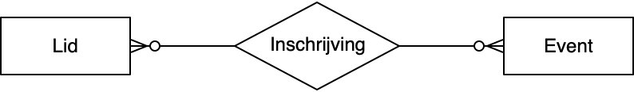
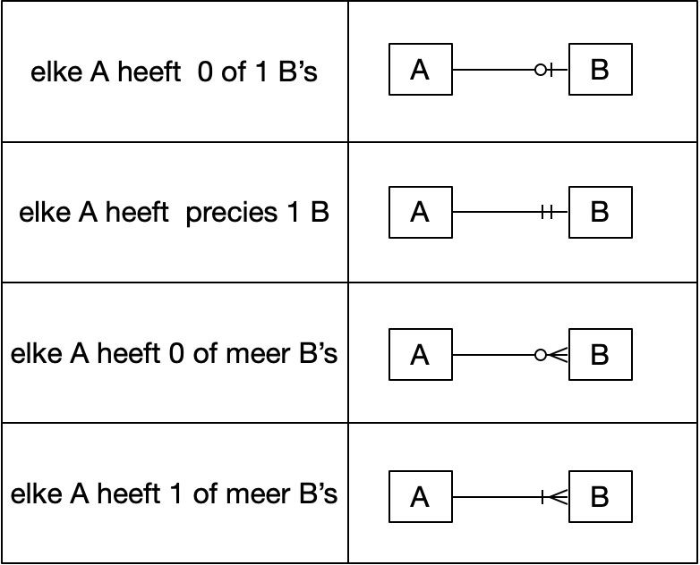
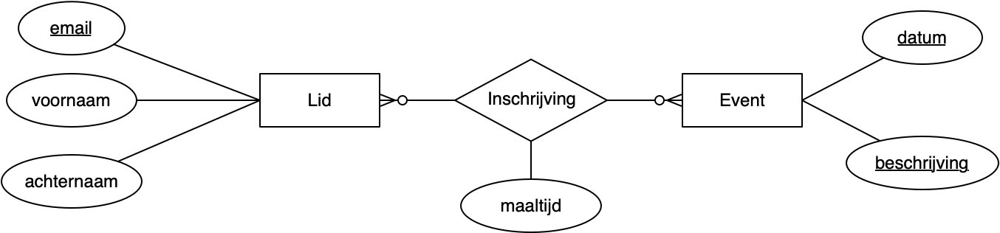

Een logisch model
=================

We geven hier een voorbeeld een logisch model in de vorm van een Entity-Relationship Diagram.
We gebruiken weer hetzelfde voorbeeld als in het vorige hoofdstuk:
een webtoepassing waarmee leden zich kunnen inschrijven voor één of meer events.

  Entity-Relationship diagram - eerste stap

Dit is een eerste, nog onvolledige stap naar het logische model.
De belangrijkste elementen in het model zijn:

* Lid: een entiteit
* Event: een entiteit
* Inschrijving: een relatie tussen Lid en Event.

Een **Entiteit** is een concreet of abstract "ding" dat betekenis heeft in de organisatie ("business").
Je geeft een entiteit aan met een zelfstandig naamwoord.
In een E-R diagram gebruiken we een rechthoek met daarin de naam van de entiteit.

Een **Relatie** geeft het verband tussen twee of meer entiteiten weer.
Je geeft een relatie aan met een werkwoord (bijvoorbeeld "inschrijven") of een werkwoordsvorm ("inschrijving").
In een E-R diagram gebruiken we een ruit met daarin de naam van de relatie.

Je kunt het bovenstaande lezen als: een Lid heeft zich ingeschreven voor een Event.

Multipliciteit
--------------

  Kraaienpootnotatie voor multipliciteit

In de figuur hierboven zie je ook wat de multipliciteit is van de relatie,
aan de hand de kraaienpoot-notatie.
Je ziet dan direct of er sprake is van een 1-1 relatie, een 1-N relatie, of een N-M relatie;
en of de relatie optioneel is (0 als ondergrens) of verplicht (1 als ondergrens).

Zo'n kraaienpoot kun je zien als een speciale pijl die je leest als "heeft".
Het onderwerp van de zin staat aan het begin van de pijl;
de relatie beschrijf je als een werkwoordsvorm;
het aantal staat aan de kant van de pijlpunt, bij het lijdend voorwerp in de zin.

Uit de ERD-figuur hierboven kunnen we dan aflezen:

* *elk* Lid heeft zich ingeschreven voor 0 of meer Events;
* *elk* Event heeft 0 of meer ingeschreven Leden.

Aan de hand van dergelijke "ERDish" zinnen kan een ontwerper nagaan bij een gebruiker of domein-expert of hij de organisatie of toepassing goed begrepen heeft.

  *Opmerking.* Soms kom je de term *cardinaliteit* tegen in plaats van *multipliciteit*. We volgen hier de terminologie en de motivatie erachter van `Martin Fowler <https://martinfowler.com/bliki/MultiplicityNotCardinality.html>`_.

* `Wikipedia: Entity-Relationshipmodel <https://nl.wikipedia.org/wiki/Entity-relationshipmodel>`_

Attributen
----------

We hebben in het model meer details nodig over de entiteiten en de relaties,
in de vorm van attributen.

Een **attribuut** beschrijft een eigenschap van een entiteit of relatie.

  E-R model met entiteiten, relatie en attributen

In de bovenstaande figuur zien we het volgende:

* de entiteit Lid heeft als attributen: *email*-adres, voornaam, achternaam;
* de entiteit Event heeft als attributen: *datum*, *beschrijving*;
* de relatie Inschrijving heeft als attribuut: maaltijd (-keuze).

Identificatie
-------------

De namen van enkele van de attributen zijn in de figuur onderstreept.
Hiermee geef je aan dat deze attributen de bijbehorende entiteit *identificeren*:

* het attribuut *email* identificeert een Lid;
* de combinatie van *datum* en *beschrijving* identificeert een Event.

Dit is de **unieke identificatie (UID)** van de entiteiten zoals de "business" dit gebruikt.

Later gaan we in op de identificatie van een Inschrijving.
