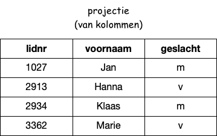
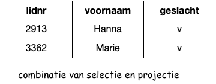

************************
Rekenen met relaties (1)
************************

Een relationele database wordt zo genoemd omdat een tabel (zoals hierboven beschreven) wiskundig gezien een relatie voorstelt.
Het rekenen met tabellen kun je dan uitdrukken met relationele operaties.
Enkele voorbeelden van dit soort operaties:

* *selectie* in een tabel A, op basis van een voorwaarde: het resultaat is een tabel die alleen de rijen van A bevat die aan de voorwaaarde voldoen;

  Selectie van de rijen uit de tabel ``leden`` waarvoor geldt: ``geslacht = "v"``

* *projectie* van een tabel A, op basis van een reeks kolomnamen: het resultaat is een tabel die alleen de kolommen van A bevat met de genoemde namen;

  Projectie van de kolommen ``lidnr, voornaam, achternaam`` uit de tabel ``leden``

* je kunt deze selectie en projectie ook combineren.

  Combinatie van selectie en projectie

Deze operaties leveren steeds een tabel op waarmee je weer verder kunt rekenen.
*Merk op* dat het resultaat kan bestaan uit een tabel met een enkele rij,
of uit een lege tabel, bijvoorbeeld als er geen rij aan de selectie-voorwaarde voldoet.

Bovenstaande betekent dat je formules kunt maken die je samenstelt uit tabellen en deze operaties.
Het rekenen met relaties is hierdoor een krachtig middel voor het werken met database-gegevens.

Later behandelen we het *cartesisch* product van tabellen A en B: een tabel met alle combinaties van de rijen van A en B;
en het samenvatten (*aggregatie*) van de waarden in een kolom van een tabel, bijvoorbeeld tot de som van de waarden.

Opdrachten
----------

De oefenopdrachten voor relationele databases vind je in een Jupyter Notebook.
Dit kun je uitvoeren met de volgende
`Binder-opdracht <https://mybinder.org/v2/gh/infvo/ieni2019-SQL.git/master?filepath=Inhoud.ipynb>`_.
Je kunt in deze notebooks je eigen aanpassingen maken, en "spelen" met de data en de database-opdrachten.

De broncode van de notebooks vind je op GitHub,
zie: `SQL notebooks op GitHub <https://github.com/infvo/ieni2019-SQL>`_
