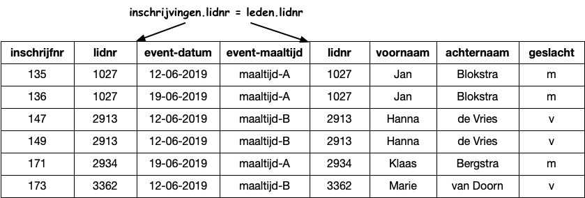

Rekenen met relaties (2)
========================

Als we een tabel willen maken met alle inschrijvingen voor een bepaalde event,
met de namen van de leden erin,
dan moeten we combinaties maken van de rijen van de leden-tabel en van de inschrijvingen-tabel.
In een *cartesisch product* (zie opdrachten) maken we alle combinaties,
maar we zijn hier alleen geïnteresseerd in de combinaties waarvoor geldt:
``inschrijvingen.lidnr = leden.lidnr``.
We krijgen dan onderstaande tabel:

  Een join-tabel van ``leden`` en ``inschrijvingen`` waarvoor ``inschrijvingen.lidnr = leden.lidnr``

Van dit resultaat kunnen we weer de kolommen selecteren (*projectie*)
en de rijen (*selectie*) die we in het eindresultaat willen zien.

.. figure:: join-tabel-selectie.png
  :width: 600px
  :align: center

  Een join-tabel na selectie en projectie

Opdrachten
----------

Toetsvragen
-----------
